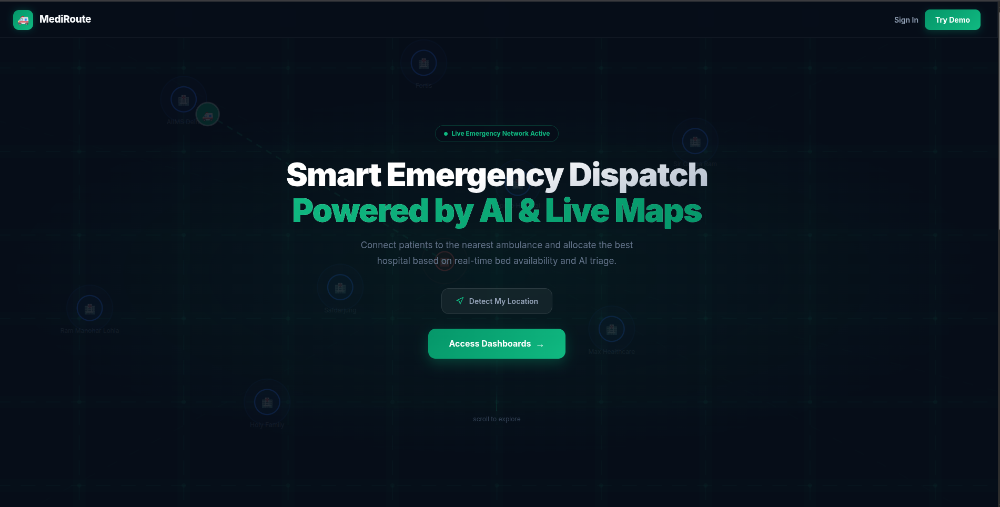
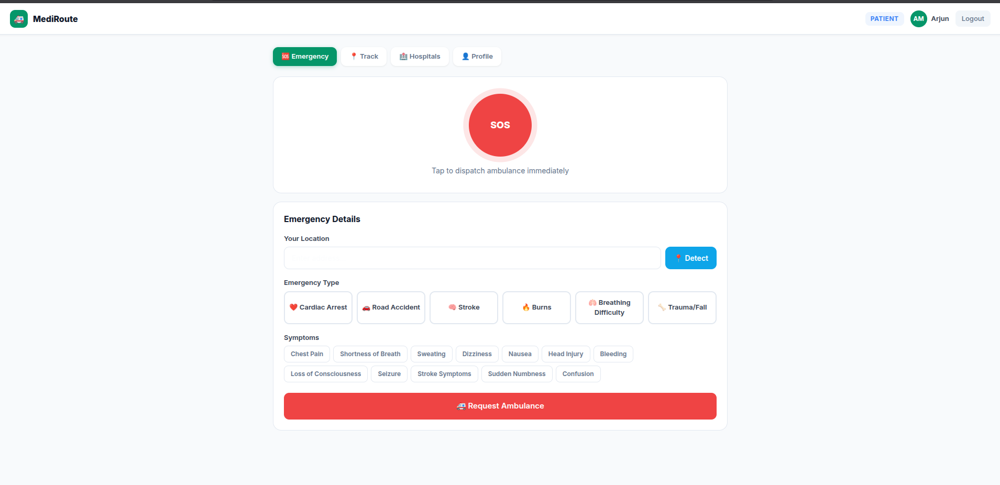
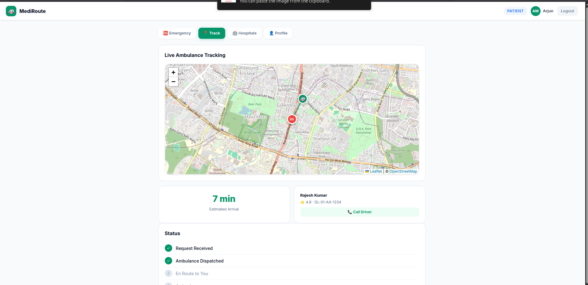

<div align="center">
  
  <h1>🚑 MediRoute</h1>
  <p><strong>Smart Emergency Dispatch Platform Powered by AI & Live Maps</strong></p>
</div>

<br />

## 📖 Overview

**MediRoute** is a high-performance, real-time emergency response platform designed to bridge the gap between patients, ambulances, and hospitals. By leveraging live geolocation, AI triage, and the OpenStreetMap Overpass API, MediRoute ensures that critical care is dispatched faster and routed smarter. 

From the moment an SOS is triggered to the patient's arrival at the hospital, the platform provides seamless coordination between the **Patient**, **Ambulance Driver**, **Hospital Staff**, and **Platform Admins**.

---

## 🌟 Key Features

* **Real-Time Geolocation & Live Maps:** Instant detection of user coordinates, reverse-geocoded via Nominatim. Fully interactive Leaflet maps tracking real-world movements.
* **Live Hospital Data:** Integrates with the **OpenStreetMap Overpass API** to fetch and plot actual hospitals within a 5km radius dynamically based on the patient's location.
* **Smart Routing & ETA:** Computes Haversine distance to calculate accurate, real-time ETAs for incoming ambulances and routes to the selected hospital.
* **AI-Assisted Triage:** Analyzes patient symptoms (e.g., Cardiac Arrest, Trauma) to recommend the best-equipped hospital based on real-time bed and ICU availability.
* **Multi-Role Dashboards:**
  * **Patient:** One-tap SOS, live ambulance tracking, and AI-ranked hospital selection.
  * **Driver:** Turn-by-turn navigation, patient medical profile access, and hospital routing.
  * **Hospital:** Incoming emergency alerts, bed/ICU inventory management, and pre-arrival prep.
  * **Admin:** Overarching command center to monitor all active emergencies and fleet status.

---

## 📸 Platform Previews

### 1. Patient SOS Dashboard
A streamlined, panic-proof interface allowing patients to trigger an SOS, input their emergency type, and select symptoms in seconds.
<div align="center">
  
</div>

<br />

### 2. Live Map & Ambulance Tracking
Once an ambulance is dispatched, the patient can track its live location, view the driver's details, and see the exact ETA on an interactive map.
<div align="center">
  
</div>

---

## 🛠️ Technology Stack

* **Frontend:** React 18, TypeScript, Vite
* **Styling:** Tailwind CSS, Vanilla CSS (Glassmorphism & custom animations)
* **Maps & Geospatial:** React-Leaflet, Leaflet.js
* **APIs:** 
  * OpenStreetMap Nominatim (Reverse Geocoding)
  * OpenStreetMap Overpass API (Live Amenities/Hospital querying)
* **State Management:** Zustand
* **Icons:** Lucide React

---

## 🚀 Getting Started

Follow these instructions to set up the MediRoute platform locally.

### Prerequisites
* Node.js (v18 or higher recommended)
* npm or yarn

### Installation

1. **Clone the repository:**
   ```bash
   git clone 
   cd mediroute
   ```

2. **Install dependencies:**
   ```bash
   npm install
   ```

3. **Start the development server:**
   ```bash
   npm run dev
   ```

4. **Open your browser:**
   Navigate to `http://localhost:5173` to view the application.

---

## 🗺️ How It Works (The Emergency Flow)

1. **Instant SOS:** The patient triggers an SOS. GPS coordinates and medical profiles are instantly captured.
2. **Live Tracking:** The nearest ambulance is dispatched. Real-time maps track the route with a live ETA.
3. **AI Triage & Selection:** AI analyzes the patient's symptoms and ranks nearby hospitals fetched from OSM. The patient (or system) selects the optimal hospital.
4. **Hospital Prep:** The destination hospital's dashboard lights up with the patient's ETA and medical details, allowing doctors and ICU teams to prepare before arrival.

---

