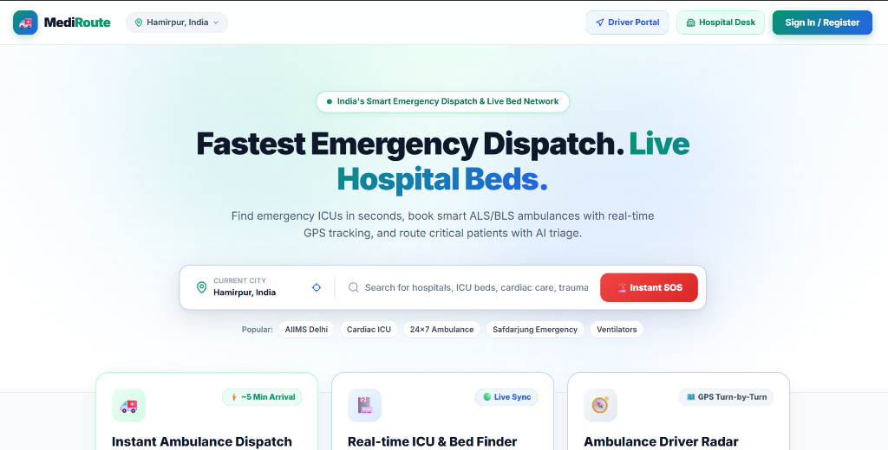
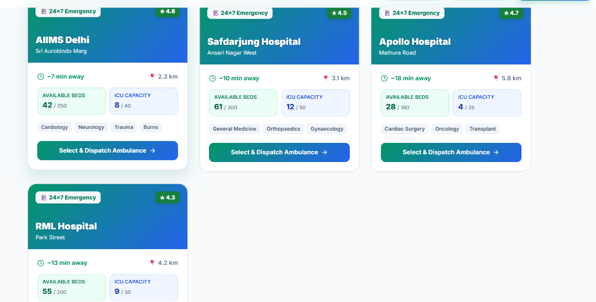
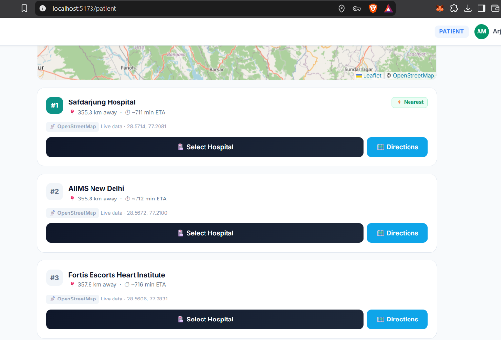

<div align="center">
  
  <br />
  <br />
  <h1>🚑 MediRoute</h1>
  <p><strong>Smart Emergency Dispatch Platform Powered by Live OpenStreetMap & Real-Time Telemetry</strong></p>

  <p>
    
    
    
    
    
  </p>
</div>

<br />

---

## 📖 Executive Summary

**MediRoute** is an end-to-end, high-performance emergency medical dispatch and live hospital bed coordination system. Built with an intuitive, consumer-first emergency discovery interface wrapped in an **Emerald Green & Sapphire Blue** clinical design system, it eliminates emergency bottlenecks by connecting patients, ambulance operators, and hospital casualty wards in real time.

Unlike static emergency directories, MediRoute queries **100% real-world hospital facilities dynamically from live OpenStreetMap & Nominatim geospatial registries**, ensuring accurate local facilities, real road distances, and exact ambulance ETAs wherever the patient is located.

---

## 📸 Platform Showcase

### 1. Smart Emergency Discovery Portal
Dual floating search bar with instantaneous GPS reverse-geocoding, curated action cards, and live hospital collections ranked by proximity and ICU bed capacity.

<div align="center">
  
</div>

<br />

### 2. Live Regional Hospital Registry
Real medical facilities fetched live from OpenStreetMap Overpass & Nominatim with real-time bed inventory, verified coordinates, and direct Google Maps navigation.

<div align="center">
  
</div>

<br />

### 3. Patient SOS & Live Interactive Tracking
One-touch SOS button with instant triage, symptom tagging, interactive Leaflet map with **"🔍 Search This Area"** capability, and real-time ambulance tracking.

<div align="center">
  
</div>

---

## 🌟 Key Architecture & Capabilities

### 🗺️ 100% Real Live Hospital Geolocation
- **No Mock Hospital Fallbacks**: Completely eliminated static Delhi mock data. 
- **Multi-Tag Medical Registry Search**: Queries OpenStreetMap nodes, ways, and relations across:
  - `amenity=hospital`
  - `amenity=clinic`
  - `healthcare=hospital`
  - `amenity=doctors`
- **Smart Auto-Radius Expansion**: Queries within a 30 km radius and automatically widens to 50 km if fewer than 5 facilities are found.
- **In-Memory Geo-Grid Caching**: Resolves repeated map queries in **< 100 ms**.
- **Interactive Map Controls**: Includes **"📍 Use My GPS"** and a floating **"🔍 Search This Area"** button when panning anywhere in the country.
- **Direct Navigation**: Deep-links to Google Maps with pre-computed origin and destination coordinates.

### 🚑 Real-Time Ambulance Dispatch & Driver Radar
- **Driver Console**: Incoming emergency alerts with countdown timer, patient blood group, severity, and pre-existing medical conditions.
- **Simulated & Real GPS Driving**: Interactive driving simulation with speed telemetry and turn-by-turn routing directly to the patient and hospital.
- **Socket.io WebSockets**: Live two-way coordinate broadcasts (`driver:location` -> `driver:location:update`).

### 🏥 Hospital Casualty Ward Desk
- **Triage Monitoring**: Real-time incoming ambulance alerts with patient vitals and symptoms.
- **Bed & ICU Inventory Management**: Live counter for Emergency, ICU, General, and Pediatric wards with one-click increment/decrement controls.

### 🔐 Real Production Authentication
- **Secure Credentials**: Passwords salted and hashed with `bcryptjs`.
- **Stateless Tokens**: Industry-standard signed JWT (`jsonwebtoken`) with 7-day expiration.
- **Prisma & SQLite**: Persistent relational database storage for users, hospitals, ambulances, and emergency incidents.

---

## 🛠️ Technology Stack

| Layer | Technology |
|---|---|
| **Frontend Framework** | React 18 with TypeScript |
| **Build Tooling** | Vite 6.2 |
| **Styling & Theme** | Tailwind CSS + Vanilla CSS (Glassmorphism & Micro-animations) |
| **Maps & GIS** | React-Leaflet 5, Leaflet.js, OpenStreetMap Tiles |
| **Live Geocoding** | OpenStreetMap Overpass API & Nominatim Reverse Geocoding |
| **Backend Runtime** | Node.js (v20+) with Express |
| **ORM & Database** | Prisma 6.4 with SQLite (`dev.db`) |
| **Real-Time Transport**| Socket.io (WebSockets) |
| **Icons** | Lucide React |

---

## 🚀 Getting Started

### Prerequisites
- Node.js (v18.0 or higher; v20.17 recommended)
- npm or yarn

### 1. Installation
Clone the repository and install dependencies for both frontend and backend:

```bash
# Clone repository
git clone <repo-url>
cd MediRoute

# Install frontend dependencies
npm install

# Install backend dependencies
cd backend
npm install
cd ..
```

### 2. Database Migration & Seeding
Initialize the SQLite database with Prisma schema:

```bash
cd backend
npx prisma generate
npx prisma db push
cd ..
```

### 3. Run Locally

Open two terminal windows:

**Terminal 1 — Start Backend Server (`:5000`):**
```bash
cd backend
npm run dev
```

**Terminal 2 — Start Frontend Server (`:5173`):**
```bash
npm run dev
```

Visit **`http://localhost:5173`** in your browser.

---

## 👥 Default Demo Credentials

Pre-seeded accounts are available for testing role-specific features:

| Role | Email | Password | Access Portal |
|---|---|---|---|
| **Patient** | `patient@mediroute.in` | `Password123!` | `/patient` |
| **Ambulance Driver** | `driver@mediroute.in` | `Password123!` | `/driver` |
| **Hospital Staff** | `hospital@mediroute.in` | `Password123!` | `/hospital` |

---

## 🌐 API Endpoints Reference

| Method | Route | Description |
|---|---|---|
| `POST` | `/api/auth/register` | Register new user account with role |
| `POST` | `/api/auth/login` | Login and receive signed JWT token |
| `GET` | `/api/auth/me` | Fetch authenticated user profile |
| `GET` | `/api/hospitals/nearby?lat=...&lng=...` | **100% Real Live OSM hospital discovery** |
| `GET` | `/api/ambulances` | List available ambulance fleet |
| `POST` | `/api/emergencies` | Create emergency dispatch incident |
| `GET` | `/api/emergencies` | List active emergency requests |
| `PATCH` | `/api/emergencies/:id/status` | Update dispatch status (`en_route`, `arrived`) |

---

## 📄 License
This project is open-source and licensed under the **MIT License**.
